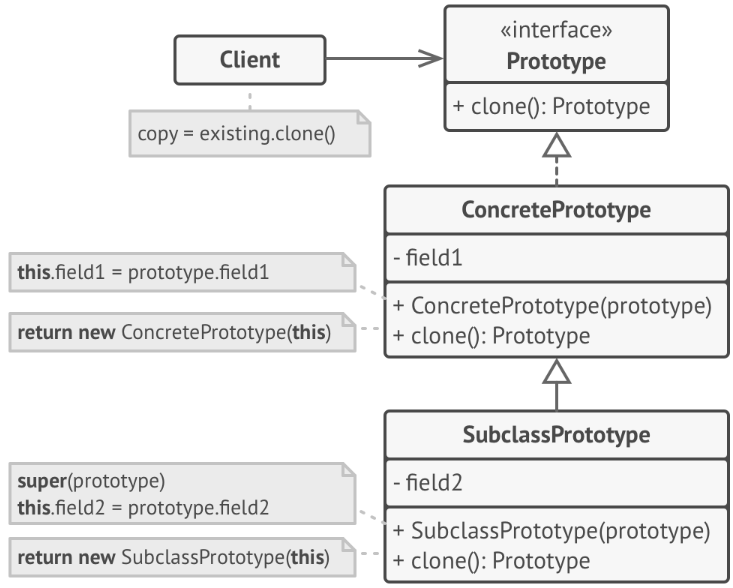
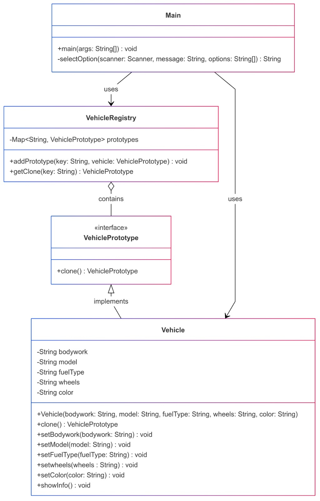

# Implementación del Patrón Prototype

## Descripción del Patrón

El patrón Prototype es utilizado para crear (clonar) objetos duplicados de una instancia existente sin que el código dependa de sus clases específicas y delegar el proceso de clonación a
los propios objetos que están siendo clonados. Este proyecto demuestra su implementación mediante un ejemplo práctico en **Java** utilizando **Maven** como gestor de dependencias.

## Estructura del Proyecto
La estructura del proyecto sigue el estándar de **Maven**:

```
Prototype
│
├── pom.xml                # Archivo de configuración de Maven
├── README.md              # Documentación del proyecto
└── src/main/java          # Carpeta con los códigos
    |
    ├── Main.java          # Para ejecutar el programa
    │
    └── Prototype
        |── Vehicle.java                 # Clase de Java
        |── VehiclePrototype.java        # Clase de Java
        └── VehicleRegistry.java         # Clase de Java
```

---

## Dependencias Utilizadas
Este proyecto no utiliza dependencias adicionales que deban ser definidas en el archivo **pom.xml**.

## Instrucciones de Instalación

1. **Clonar el repositorio:**
```bash
git clone https://github.com/Syreus311/Prototype.git
cd Prototype
```

2. **Compilar el proyecto:**
```bash
mvn clean install
mvn clean compile              (opcional)
```

3. **Ejecutar el proyecto:**
```bash
mvn exec:java
```

---

## Ejemplo de Ejecución
Al ejecutar el programa, deberías ver la siguiente salida:
```
[Ejemplo de resultado del programa]
```

---

## Diagrama UML

El siguiente diagrama muestra la estructura estándar del patrón Prototype:


El siguiente diagrama muestra la estructura del patrón implementado:


---

## Explicación de la Implementación
El patrón [Nombre del Patrón] ha sido implementado utilizando las siguientes clases principales:
- **[Clase 1]**: Explicación del propósito de la clase.
- **[Clase 2]**: Explicación del propósito de la clase.
- **[Clase 3]**: Explicación del propósito de la clase.

---

## Contribuciones
Este proyecto fue desarrollado por:
- [Katherin Juliana Moreno Carvajal]
- [Santiago Navarro Cuy]
- [Mariana Salas Gutiérrez]
